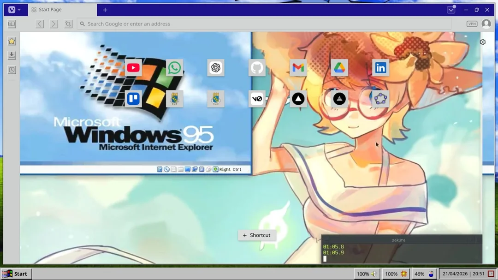
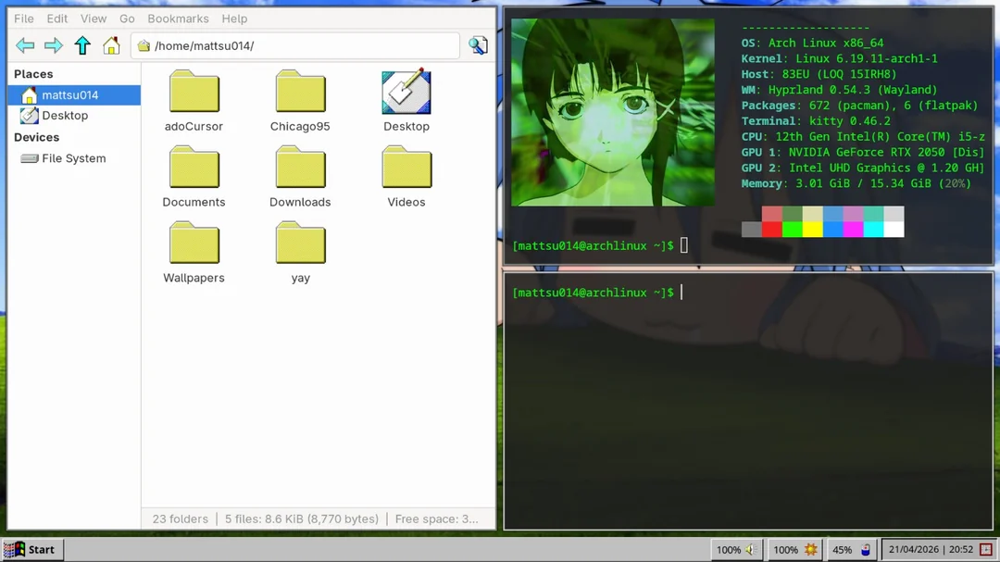
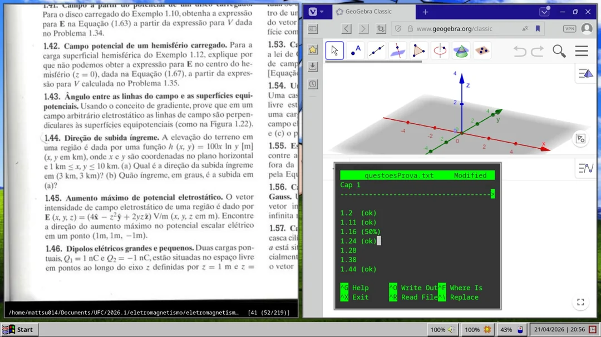

# 🐧 Arch 95 - Hyprland OS + Windows 95 🐧


## 🖥️ Sobre

Este repositório contém meu “rice” do Arch Linux (configuração personalizada).
Criei esse setup com o objetivo de recriar a estética clássica do Windows 95 em um ambiente moderno, leve e altamente configurável utilizando o Hyprland.

---

## ✨ Pacotes

### Componentes principais

* Waybar
* Rofi

### Aplicações principais

* **Terminal:** Kitty
* **Launcher:** Rofi
* **Editor:** VS Code / Nano
* **Navegador:** Vivaldi (com tema customizado)

---

## 🎨 Screenshots







---

## ⚠️ Aviso

Essas configurações podem não funcionar corretamente em todos os sistemas.
Sinta-se livre para modificar e adaptar tudo conforme o seu ambiente.

---

## 🔮 Atualizações futuras

* Automatizar o processo de instalação

---

## 📁 Estrutura

```
.
├── README.md
├── screenshots
│
└── systemRice
    ├── fastfetch
    ├── gtk-3.0
    ├── hypr
    ├── kitty
    ├── rofi
    └── waybar
```

---

## ✏️ Créditos

Obrigado à comunidade Linux e Hyprland pelo incrível trabalho ❤️

* **Ícones & Tema:** [Chicago95](https://github.com/grassmunk/chicago95)
* **Tema do Vivaldi:** [Win95](https://themes.vivaldi.net/themes/x3WlOeREJGY)
