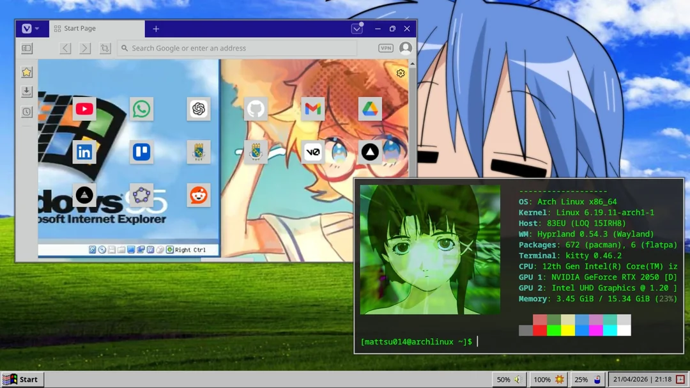

# 🐧 Arch 95 - Hyprland OS + Windows 95 Theme 🐧

---

---

## 🌎 Languages

* [Português (Brasil) 🇧🇷](./README-pt-br.md)

---

## 🖥️ About

This repository contains my Arch Linux “rice” (custom setup).
I created this configuration with the goal of recreating the classic Windows 95 aesthetic in a modern, lightweight, and highly customizable environment using Hyprland.

---

## ✨ Packages

### Core Components

* Waybar
* Rofi

### Main Applications

* **Terminal:** Kitty
* **Launcher:** Rofi
* **Editor:** VS Code / Nano
* **Browser:** Vivaldi (with a custom theme)

---

## ⚠️ Warning

These configurations may not work correctly on all systems.
Feel free to customize and adapt everything to fit your setup.

---

## 🔮 Future Updates

* Automate the installation process

---

## 📁 Structure

```
.
├── README.md
├── screenshots
│
└── systemRice
    ├── fastfetch
    ├── gtk-3.0
    ├── hypr
    ├── kitty
    ├── rofi
    └── waybar
```

---
## ✏️ Credits

Thanks to the Linux and Hyprland communities for their amazing work ❤️

* **Icons & Theme:** [Chicago95](https://github.com/grassmunk/chicago95)

* **Vivaldi Theme:** [Win95](https://themes.vivaldi.net/themes/x3WlOeREJGY)


